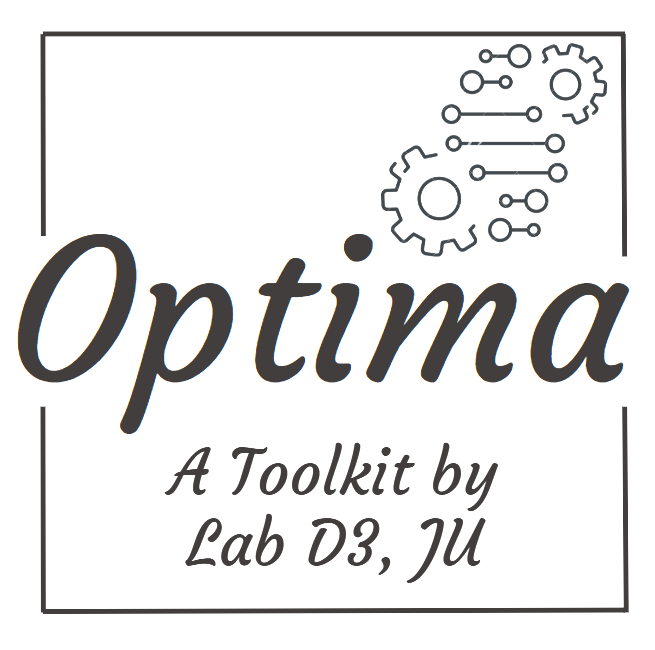
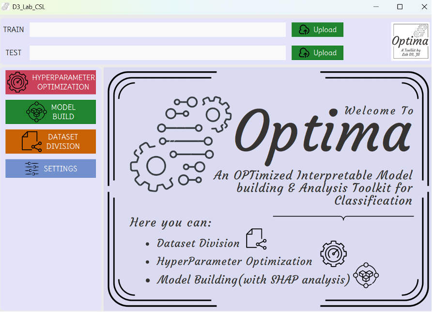
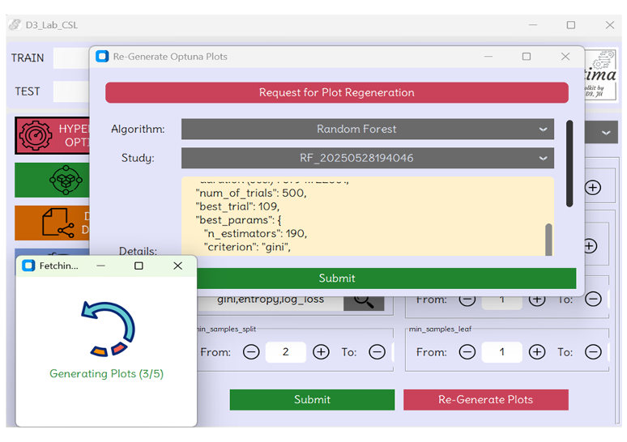
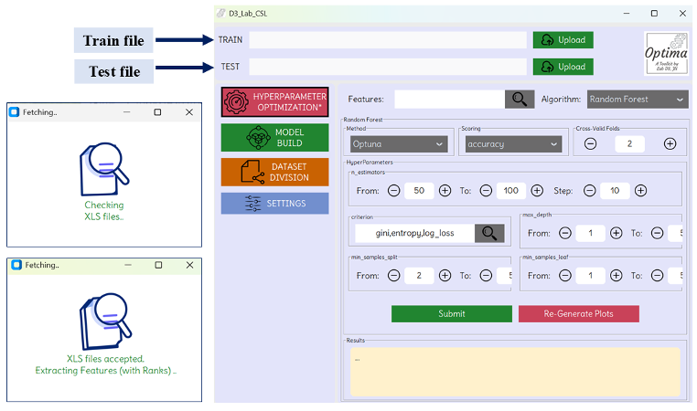

<!-- Header with Icon -->

  
  <h1>Optima</h1>
  <h3>OPTimized Interpretable Model Building & Analysis Toolkit</h3>

---

## 🔗 Download

You can download the latest release from SourceForge:

---

## ✨ Features

- ✅ Intuitive UI with CustomTkinter
- ✅ Lightweight and portable executable
- ✅ Supports both random and rational dataset splitting strategies, including Kennard-Stone and activity-based division. 
- ✅ Users can also directly input their own training and test sets, with an integrated validation process that ensures both sets share a consistent data structure for reliable model performance.
- ✅ Incorporates proper feature selection algorithms, such as Most Discriminating Feature (MDF) selection and Mutual Information Score (MIS), to identify the most relevant features for model development.
- ✅ Offers three powerful optimization methods- Grid Search CV, Randomized Search CV, and Optuna for fine-tuning of the different hyperparameters of the model. 
- ✅ Visualization plots will be generated for the Optuna-based optimization process, which provide clear insights into the tuning process.
- ✅ Supports the development of seven different types of machine learning-based classification models with ROC curves and an extensive set of evaluation metrics to assess performance.
- ✅ Tackles the crucial challenge of model transparency by generating SHAP summary plots for each model, offering clear and interpretable visualizations of feature importance and contribution.
- ✅ Includes a dedicated settings panel that empowers users to customize all visual outputs, including colour schemes, titles, fonts, labels, etc., to align with their preferences or publication standards.

---

## 🖼️ Preview

---
